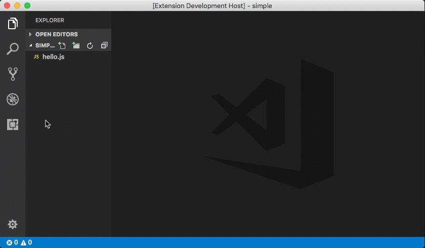

# VS Code Auto Attach

The VS Code Auto Attach extension automatically attaches the Node.js debugger to node.js programs launched from VS Code's integrated terminal.



## Installing VS Code Auto Attach

This extension is still a prototype and so it is not yet available on the Marketplace but you can easily build the vsix with these commands:

```
  git clone https://github.com/weinand/vscode-auto-attach
  cd vscode-auto-attach
  npm install
  npm run package
```

Then use VS Code's **Install from VSIX...** command to install the extension.

## Using VS Code Auto Attach

Run a node program in debug mode from VS Code's integrated terminal and this extension will automatically attach VS Code's node debugger to it.

Instead of running node explicitly you can of course run a script too, e.g. `npm run debug` or `yarn debug`.
